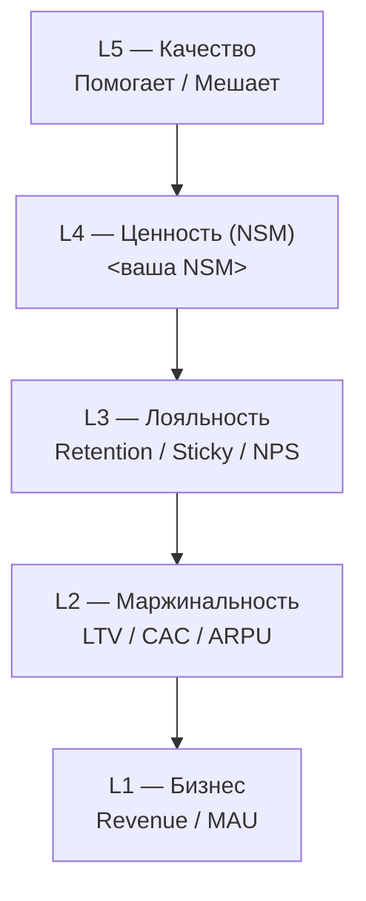

## Обзор

Пирамида метрик — иерархическая модель из 5 уровней (сверху вниз):

| # | Уровень | Суть |
|---|---------|------|
| 1 | Бизнес | Revenue, MAU — цели компании и инвесторов |
| 2 | Маржинальность | LTV, CAC, ARPU — юнит-экономика |
| 3 | Лояльность | Retention, NPS, K-factor — возврат и рекомендации |
| 4 | Ценность (NSM) | Ключевая ценность продукта для клиента |
| 5 | Качество | Помогает / мешает пользователю — баги, трение |

**Два ключевых направления работы:**
- **Сверху вниз (декомпозиция):** разбиваем бизнес-цель на управляемые метрики нижних уровней.
- **Снизу вверх (правило иерархии):** инициатива не идёт в прод, если улучшает нижний уровень, но роняет верхний.

## Рабочий процесс

**Прогресс:**
- [ ] Шаг 1: Определить контекст продукта
- [ ] Шаг 2: Зафиксировать бизнес-цель (Уровень 1)
- [ ] Шаг 3: Определить маржинальность (Уровень 2)
- [ ] Шаг 4: Выбрать метрики лояльности (Уровень 3)
- [ ] Шаг 5: Сформулировать NSM — метрику ценности (Уровень 4)
- [ ] Шаг 6: Определить метрики качества (Уровень 5)
- [ ] Шаг 7: Проверить правило иерархии и прогнать CHECKS.md
- [ ] Шаг 8: Оформить результат

### Шаг 1: Определить контекст продукта

Соберите у пользователя:
- **Тип продукта:** B2B / B2C / B2B2C / маркетплейс / SaaS.
- **Стадия:** идея / MVP / рост / масштабирование.
- **Монетизация:** подписка / транзакция / реклама / freemium.
- **Целевая аудитория:** кто клиент и его главная проблема (job-to-be-done).

Если пользователь не знает — задайте уточняющие вопросы.

### Шаг 2: Зафиксировать бизнес-цель (Уровень 1)

Выберите 1–2 ключевые метрики верхнего уровня:
- **С монетизацией:** Revenue, ARR, MRR.
- **Без монетизации (ранняя стадия):** MAU, DAU, регистрации, Market Share.

Формулировка: «Бизнес-цель: {метрика} = {текущее} → {целевое} за {период}».

### Шаг 3: Определить маржинальность (Уровень 2)

- **LTV** — обязателен для продуктов с монетизацией (указывайте период когорты).
- **CAC** — обязателен если есть маркетинг.
- **ARPU / ARPPU** — для среднего чека.
- **Правило:** LTV / CAC ≥ 3.

При отсутствии данных у пользователя — найдите бенчмарки LTV/CAC и конверсий по индустрии через доступный веб-поиск или у пользователя. Источники зафиксируйте в разделе «Источники» артефакта.

### Шаг 4: Выбрать метрики лояльности (Уровень 3)

2–3 метрики из:
- **Retention** по когортам — ключевой предсказатель LTV.
- **Churn Rate** — обратная сторона Retention.
- **Sticky Factor** (DAU/MAU) — только для продуктов с ежедневным использованием.
- **K-factor** — для виральных продуктов.
- **NPS** — если есть регулярные опросы.
- **C2** — для e-commerce / подписок (≠ Retention).

### Шаг 5: Сформулировать NSM — метрику ценности (Уровень 4)

Это самый важный шаг. **Одна** метрика, отражающая ключевую ценность для клиента.

**Формула поиска NSM:**
1. Какую проблему решает продукт? (job-to-be-done)
2. Как клиент измеряет успех? (экономия времени / денег / усилий)
3. Какое действие в продукте лучше всего коррелирует с Retention?

**Критерии хорошей NSM:** измерима, коррелирует с Retention/Revenue, клиентоцентрична, понятна команде.

### Шаг 6: Определить метрики качества (Уровень 5)

Разделите:
- **Помогающие:** % завершённых сценариев, time-to-first-value, использование ключевых фич.
- **Мешающие:** баги (в 3-х разрезах — на сессию, на пользователя, доля юзеров за месяц), % ошибок, downtime.

Метрики нормируйте на сессию/пользователя/единицу услуги. Время — заменяйте на долю от сессии.

### Шаг 7: Проверить правило иерархии и прогнать CHECKS.md

Для каждой инициативы:
- Улучшает ли она метрику нижнего уровня?
- Не роняет ли метрику верхнего уровня?

Если роняет — инициатива не идёт в прод.

Затем прогоните весь чек-лист [CHECKS.md](CHECKS.md). Невыполненный пункт = доработать пирамиду.

### Шаг 8: Оформить результат

Выведите пирамиду в двух представлениях.

**1) Таблица с уровнями и метриками.**

**2) Визуализация Mermaid** (`flowchart TB` со связью уровней):

**Добавьте:**
- Формулировку job-to-be-done.
- Цепочку связи уровней словами: «NSM ↑ → Retention ↑ → LTV ↑ → Revenue ↑» для конкретного продукта.
- Красные флаги с порогами.

Также создайте/обновите `PROJECTS/<Имя>/PROJECT.md` по шаблону `PROJECTS/_template/PROJECT.md` (контекст, ключевые решения, риски, артефакты).

## См. также

- [REFERENCE.md](REFERENCE.md) — подробный справочник по метрикам и формулам.
- [EXAMPLES.md](EXAMPLES.md) — примеры пирамид для разных продуктов.
- [CHECKS.md](CHECKS.md) — чек-лист валидации (шаг 7).
